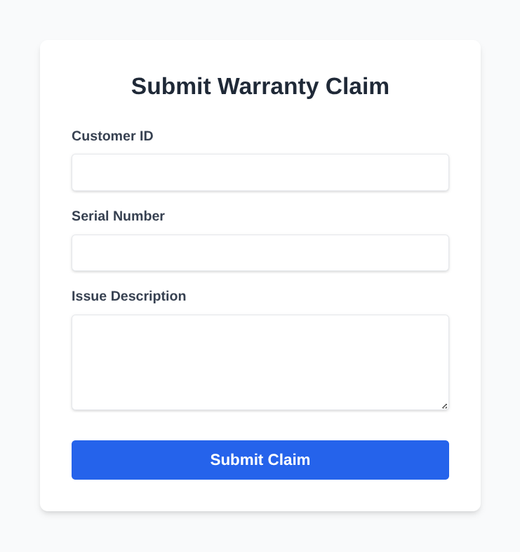

# Warranty Eval Agent

Event-driven, multi-agent system built on Google Cloud for Agentic Security, Safety, and Trust Whitepaper. It automates the warranty claim lifecycle by transforming raw user submissions into verified entitlement actions. Using a Zero-Trust Case Manager orchestrator, the system securely coordinates between specialized agents (entitlement & logistics) to verify purchase history and generate resolution outcomes—all without exposing sensitive customer PII to the public-facing entry point.

## Overview

This project implements an agentic chain triggered by customer events. It is designed with a **zero-trust** security model in mind, ensuring that the public-facing orchestrator has minimal permissions.

## Prerequisites

Before beginning the deployment, ensure the following requirements are met:

* Two distinct Google Cloud Projects: You must have Owner or Editor access to an "Image" project and an "App" project.
* Billing Enabled: Active billing accounts must be linked to both projects.
* Google Cloud CLI: Ensure gcloud is installed and authenticated (gcloud auth login).

### Enable Required APIs
Run the following commands to turn on the necessary services in each project.

For the Image Project:

```bash
gcloud services enable \
    cloudbuild.googleapis.com \
    artifactregistry.googleapis.com \
    --project="IMAGE_PROJECT_ID"
```

For the App Project:

```bash
# Replace 'your-app-project-id' with your actual project ID before running
gcloud services enable \
    run.googleapis.com \
    pubsub.googleapis.com \
    iam.googleapis.com \
    --project="APP_PROJECT_ID"
```

# Deploy Customer Warranty Portal

## 1. Set Environment Variables

Configure your terminal session with your specific project details.

```bash
# Define Project IDs
export IMAGE_PROJECT="IMAGE_PROJECT_ID"
export APP_PROJECT="APP_PROJECT_ID" # <-- REPLACE THIS

# Define Resource Names
export REGION="us-central1"
export REPO_NAME="warranty-portal-repo"
export IMAGE_NAME="portal-app:v1"
export TOPIC_NAME="warranty-claims"
export SA_NAME="portal-identity"

# Dynamically fetch the App Project Number for IAM bindings
export APP_PROJECT_NUMBER=$(gcloud projects describe $APP_PROJECT --format="value(projectNumber)")
```

## 2. Build and Push the Container Image

Navigate to (or clone) the customer-portal/ directory in this repo. This contains the `Dockerfile`, `app.py`, and `requirements.txt`. Run the following command to package your source code and push the image to the central Image Project.

```bash
gcloud builds submit \
    --project=$IMAGE_PROJECT \
    --tag=${REGION}-docker.pkg.dev/${IMAGE_PROJECT}/${REPO_NAME}/${IMAGE_NAME}
```

## 3. Configure Cross-Project Access

Grant the Cloud Run Service Agent in the App Project permission to pull the container image from the Image Project.

```bash
gcloud artifacts repositories add-iam-policy-binding $REPO_NAME \
    --project=$IMAGE_PROJECT \
    --location=$REGION \
    --member="serviceAccount:service-${APP_PROJECT_NUMBER}@serverless-robot-prod.iam.gserviceaccount.com" \
    --role="roles/artifactregistry.reader"
```

## 4. Set Up Pub/Sub

Create the destination topic in the App Project where the portal will publish incoming JSON claims.

```bash
gcloud pubsub topics create $TOPIC_NAME \
    --project=$APP_PROJECT
```

## 5. Create the Service Identity

Create a dedicated Service Account for the Cloud Run application and grant it permission to publish messages to the Pub/Sub topic.

```bash
# Create the Service Account
gcloud iam service-accounts create $SA_NAME \
    --project=$APP_PROJECT \
    --display-name="Customer Portal Service Account"

# Grant the Pub/Sub Publisher role
gcloud pubsub topics add-iam-policy-binding $TOPIC_NAME \
    --project=$APP_PROJECT \
    --member="serviceAccount:${SA_NAME}@${APP_PROJECT}.iam.gserviceaccount.com" \
    --role="roles/pubsub.publisher"
```

## 6. Deploy to Cloud Run

Deploy the service using the cross-project image, attach the dedicated service account, and open it to public traffic.

```bash
gcloud run deploy warranty-portal \
    --project=$APP_PROJECT \
    --image=${REGION}-docker.pkg.dev/${IMAGE_PROJECT}/${REPO_NAME}/${IMAGE_NAME} \
    --region=$REGION \
    --allow-unauthenticated \
    --service-account=${SA_NAME}@${APP_PROJECT}.iam.gserviceaccount.com \
    --set-env-vars=PUBSUB_TOPIC=$TOPIC_NAME,GOOGLE_CLOUD_PROJECT=$APP_PROJECT
```

After the app is deployed, navigate to the Service URL. The site should resemble the following



# Test Claim Submission

The application will not publish any of the claims yet. First, we need to create a subscription.

## 1. Create a Pull Subscription

Run this command to create a receiver for your messages in the App Project.

```bash
gcloud pubsub subscriptions create warranty-claims-sub \
    --topic=$TOPIC_NAME \
    --project=$APP_PROJECT
```

## 2. Submit a Test Claim

1. Open your Cloud Run URL in your browser
1. Fill out the form with these details:
    - Customer ID: C-552
    - Serial Number: SN-99812
    - Issue: The battery no longer holds a charge.
1. Click Submit Claim. You should see a success message on the site.

## 3. Pull the Message from the Terminal

Now, let's see if the message actually made it to the subscription. We'll pull the message and look at the data.

```bash
gcloud pubsub subscriptions pull warranty-claims-sub \
    --project=$APP_PROJECT \
    --auto-ack \
    --format="json"
```

You should see a JSON output containing the `data` field. The data is base64 encoded by default, but the gcloud command usually decodes it in the output. It should resemble the following: `{"event": "claim_submitted", "customer_id": "C-552", ...}`
