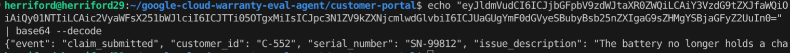

# Warranty Eval Agent

Event-driven, multi-agent system built on Google Cloud for Agentic Security, Safety, and Trust Whitepaper. It automates the warranty claim lifecycle by transforming raw user submissions into verified entitlement actions. Using a Zero-Trust Case Manager orchestrator, the system securely coordinates between specialized agents (entitlement & logistics) to verify purchase history and generate resolution outcomes—all without exposing sensitive customer PII to the public-facing entry point.

## Prerequisites

Before beginning the deployment, ensure the following requirements are met:

* Two distinct Google Cloud Projects: You must have Owner or Editor access to an "Image" project and an "App" project.
* Billing Enabled: Active billing accounts must be linked to both projects.
* Google Cloud CLI: Ensure gcloud is installed and authenticated (gcloud auth login).

### Enable Required APIs
Run the following commands to turn on the necessary services in each project.

For the Image Project:

```bash
gcloud services enable \
    cloudbuild.googleapis.com \
    artifactregistry.googleapis.com \
    containerscanning.googleapis.com \
    --project="IMAGE_PROJECT_ID"
```

For the App Project:

```bash
# Replace 'your-app-project-id' with your actual project ID before running
gcloud services enable \
    run.googleapis.com \
    pubsub.googleapis.com \
    iam.googleapis.com \
    binaryauthorization.googleapis.com \
    storage.googleapis.com \
    logging.googleapis.com \
    monitoring.googleapis.com \
    clouderrorreporting.googleapis.com \
    cloudtrace.googleapis.com \
    cloudresourcemanager.googleapis.com \
    --project="APP_PROJECT_ID"
```

# Deploy Customer Warranty Portal

## 1. Set Environment Variables

Configure your terminal session with your specific project details.

```bash
# Define Project IDs
export IMAGE_PROJECT="IMAGE_PROJECT_ID"
export APP_PROJECT="APP_PROJECT_ID" # <-- REPLACE THIS

# Define Resource Names
export REGION="us-central1"
export REPO_NAME="warranty-portal-repo"
export IMAGE_NAME="portal-app:v1"
export TOPIC_NAME="warranty-claims"
export SA_NAME="portal-identity"
export AGENT_REPO_NAME="agent-registry"
export BUCKET_NAME="agent-1-vault-${APP_PROJECT}"
export STAGING_BUCKET="agent-1-staging-${APP_PROJECT}"

# Dynamically fetch the App Project Number for IAM bindings
export APP_PROJECT_NUMBER=$(gcloud projects describe $APP_PROJECT --format="value(projectNumber)")
```

## 2. Build and Push the Container Image

Navigate to (or clone) the customer-portal/ directory in this repo. This contains the `Dockerfile`, `app.py`, and `requirements.txt`. Run the following command to package your source code and push the image to the central Image Project.

```bash
gcloud builds submit \
    --project=$IMAGE_PROJECT \
    --tag=${REGION}-docker.pkg.dev/${IMAGE_PROJECT}/${REPO_NAME}/${IMAGE_NAME}
```

## 3. Configure Cross-Project Access

Grant the Cloud Run Service Agent in the App Project permission to pull the container image from the Image Project.

```bash
gcloud artifacts repositories add-iam-policy-binding $REPO_NAME \
    --project=$IMAGE_PROJECT \
    --location=$REGION \
    --member="serviceAccount:service-${APP_PROJECT_NUMBER}@serverless-robot-prod.iam.gserviceaccount.com" \
    --role="roles/artifactregistry.reader"
```

## 4. Set Up Pub/Sub

Create the destination topic in the App Project where the portal will publish incoming JSON claims.

```bash
gcloud pubsub topics create $TOPIC_NAME \
    --project=$APP_PROJECT
```

## 5. Create the Service Identity

Create a dedicated Service Account for the Cloud Run application and grant it permission to publish messages to the Pub/Sub topic.

```bash
# Create the Service Account
gcloud iam service-accounts create $SA_NAME \
    --project=$APP_PROJECT \
    --display-name="Customer Portal Service Account"

# Grant the Pub/Sub Publisher role
gcloud pubsub topics add-iam-policy-binding $TOPIC_NAME \
    --project=$APP_PROJECT \
    --member="serviceAccount:${SA_NAME}@${APP_PROJECT}.iam.gserviceaccount.com" \
    --role="roles/pubsub.publisher"
```

## 6. Deploy to Cloud Run

Deploy the service using the cross-project image, attach the dedicated service account, and open it to public traffic.

```bash
gcloud run deploy warranty-portal \
    --project=$APP_PROJECT \
    --image=${REGION}-docker.pkg.dev/${IMAGE_PROJECT}/${REPO_NAME}/${IMAGE_NAME} \
    --region=$REGION \
    --allow-unauthenticated \
    --service-account=${SA_NAME}@${APP_PROJECT}.iam.gserviceaccount.com \
    --set-env-vars=PUBSUB_TOPIC=$TOPIC_NAME,GOOGLE_CLOUD_PROJECT=$APP_PROJECT
```

After the app is deployed, navigate to the Service URL. The site should resemble the following


# Test Claim Submission

The application will not publish any of the claims yet. First, we need to create a subscription.

## 1. Create a Pull Subscription

Run this command to create a receiver for your messages in the App Project.

```bash
gcloud pubsub subscriptions create warranty-claims-sub \
    --topic=$TOPIC_NAME \
    --project=$APP_PROJECT
```

## 2. Submit a Test Claim

1. Open your Cloud Run URL in your browser
1. Fill out the form with these details:
    - Customer ID: C-552
    - Serial Number: SN-99812
    - Issue: The battery no longer holds a charge.
1. Click Submit Claim. You should see a success message on the site.

## 3. Pull and Decode the Message

Now, let's see if the message actually made it to the subscription. We'll pull the message and look at the data.

```bash
gcloud pubsub subscriptions pull warranty-claims-sub \
    --project=$APP_PROJECT \
    --auto-ack \
    --format="json"
```

To verify the data:

1. In the output, locate the "data" field (it will look like a long string of random characters e.g., `"data": "eyJldmVudCI6..."`).
1. Copy the string
1. Run the following command, replacing `PASTE_DATA_HERE` with your string:

```bash
echo "PASTE_DATA_HERE" | base64 --decode
```
You should see the original JSON payload:



# Deploy Agent 1

Agent 1 is our case manager. The purpose of this agent is to receive the claims, make A2A calls to our other two agents, and write interaction summaries to a Storage or BigQuery table. 

## 1. Secure Artifact Infrastructure

Before deploying the agent, we need to establish the private zone where Agent 1's artifacts will live and be scanned.

```bash
# 1. Create the Secure Repository
gcloud artifacts repositories create agent-registry \
    --project=$IMAGE_PROJECT \
    --repository-format=docker \
    --location=$REGION \
    --description="Secure vault for AI Agent images and manifests"

# 2 Create the Staging Bucket
gcloud storage buckets create gs://$STAGING_BUCKET --project=$APP_PROJECT --location=$REGION
```

## 2. Initialize Environment

I'm using a venv to run Python, but you don't have to:

```bash
# 1. Create and activate a fresh virtual environment
python3 -m venv .venv
source .venv/bin/activate

# 2. Install the ADK
pip install --upgrade google-cloud-aiplatform[adk,agent_engines]
```

## 3. Provision the Agent Identity

In order to set up IAM policies before deploying our agent, we need to create an agent identity without deploying agent code. To do so, we create an Agent Engine instance with just the `identity_type` field per [our documentation](https://docs.cloud.google.com/agent-builder/agent-engine/agent-identity#create-agent-identity). 

Run the following command to automatically create the `provisioning.py` file from the /agent-1 directory:

```bash
cat << 'EOF' > provision.py
import vertexai
from vertexai import types
import os

PROJECT = os.environ.get("APP_PROJECT")

# Initialize client using v1beta1 for Agent Identity support
client = vertexai.Client(
    project=PROJECT, 
    location="us-central1", 
    http_options=dict(api_version="v1beta1")
)

# Create an empty instance
remote_app = client.agent_engines.create(
    config={"identity_type": types.IdentityType.AGENT_IDENTITY}
)

print("\n--- SAVE THESE VALUES ---")
print(f"AGENT_ENGINE_ID: {remote_app.api_resource.name.split('/')[-1]}")
print(f"PRINCIPAL_ID: {remote_app.api_resource.spec.effective_identity}")
print("-------------------------\n")
EOF
```

Run the script you just created. This will take a few minutes to deploy:

```bash
python3 provision.py
```

Now, copy the AGENT_ENGINE_ID and the PRINCIPAL_ID values and save them as environment variables

```bash
export AGENT_PRINCIPAL="principal://PASTE_YOUR_PRINCIPAL_ID_HERE"
export ENGINE_ID="PASTE_YOUR_AGENT_ENGINE_ID_HERE"
```

## 4. Grant IAM Access

Now that we have the Principal ID, we can apply IAM boundaries. These commands grant the agent exactly what it needs and nothing more.

```bash
# Grant standard Agent Engine operational roles
for ROLE in "roles/aiplatform.expressUser" "roles/serviceusage.serviceUsageConsumer" "roles/browser"; do
  gcloud projects add-iam-policy-binding $APP_PROJECT \
    --member="$AGENT_PRINCIPAL" --role="$ROLE"
done

# Grant read-only access to the Pub/Sub claims topic
gcloud pubsub topics add-iam-policy-binding warranty-claims \
    --project=$APP_PROJECT \
    --member="$AGENT_PRINCIPAL" \
    --role="roles/pubsub.viewer"

# Grant write access to your staging bucket
gcloud storage buckets add-iam-policy-binding gs://$STAGING_BUCKET \
    --project=$APP_PROJECT \
    --member="$AGENT_PRINCIPAL" \
    --role="roles/storage.objectUser"
```

## 5. Create the Agent Logic and Deployment Scripts

Next, create the files that contain the agent's logic and the deployment mechanism. 

Run this to create `agent_logic.py` file from the /agent-1 directory:

```bash
cat << 'EOF' > agent_logic.py
from google.adk.agents import Agent

agent = Agent(
    model="gemini-2.5-flash",
    name="Case_Manager_Agent_1",
    instruction="""You are the Diagnostic Orchestrator. 
    1. Categorize the failure from the issue_description.
    2. Realize you need to check if the product is under warranty.
    3. You have NO access to customer PII or financial data.
    4. Call Agent 2 for warranty verification and Agent 3 for logistics."""
)
EOF
```

Run this to create `deploy.py` file from the /agent-1 directory:

```bash
cat << 'EOF' > deploy.py
import vertexai
from vertexai.agent_engines import AdkApp
from agent_logic import agent
import os

PROJECT = os.environ.get("APP_PROJECT")
BUCKET = os.environ.get("STAGING_BUCKET")
AGENT_ID = os.environ.get("ENGINE_ID") 

client = vertexai.Client(
    project=PROJECT, 
    location="us-central1", 
    http_options=dict(api_version="v1beta1")
)

app = AdkApp(agent=agent)

# Update the empty instance with your code
remote_app = client.agent_engines.update(
    name=f"projects/{PROJECT}/locations/us-central1/reasoningEngines/{AGENT_ID}",
    agent=app,
    config={
        "display_name": "Case_Manager_Agent_1",
        "identity_type": vertexai.types.IdentityType.AGENT_IDENTITY,
        "requirements": [
            "google-cloud-aiplatform[adk,agent_engines]", 
            "pydantic", 
            "cloudpickle"
        ],
        "staging_bucket": f"gs://{BUCKET}",
    }
)
print("Agent 1 successfully deployed and secured!")
EOF
```

## 6. Deploy the Agent

Install the final dependencies:

```bash
pip install pydantic cloudpickle
```

Then run the deployment. This may take around 5-10 minutes to deploy:

```bash
python3 deploy.py
```

## 7. Test the Agent

For this, we'll write a quick Python script to act like the Customer Portal and send a mock claim directly to agent 1.

```bash
cat << 'EOF' > test.py
import os
import vertexai

PROJECT = os.environ.get("APP_PROJECT")
AGENT_ID = os.environ.get("ENGINE_ID") 

# Initialize Vertex AI using the specific v1beta1 Client
client = vertexai.Client(
    project=PROJECT, 
    location="us-central1",
    http_options=dict(api_version="v1beta1")
)

print("Connecting to Case Manager Agent...")
# For ADK, we use client.agent_engines.get() instead of ReasoningEngine()
remote_agent = client.agent_engines.get(
    name=f"projects/{PROJECT}/locations/us-central1/reasoningEngines/{AGENT_ID}"
)

mock_claim = """
New Claim Event:
- Customer ID: C-552
- Serial Number: SN-99812
- Issue Description: The battery no longer holds a charge.
"""

print("Sending mock claim...")

# ADK requires a user_id and uses stream_query
events = remote_agent.stream_query(
    user_id="test_user_001",
    message=mock_claim
)

print("\n=== Agent 1 Output ===")
# Since it's a stream, we iterate through the chunks
for event in events:
    # ADK returns dictionaries; we just want to print the generated text
    if "text" in event:
        print(event["text"], end="")
    else:
        print(event, end="")
print("\n======================\n")
EOF
```

Run the test:

```bash
python3 test.py
```

The agent should output a response acknowledging the battery issue, stating that it needs to check the warranty status and call agent 2. For example:

```
{'model_version': 'gemini-2.5-flash', 'content': {'parts': [{'text': 'Okay, I understand.\n\n**1. Categorize the failure:**\nThe issue description "The battery no longer holds a charge" indicates a **Battery Failure / Power Issue**.\n\n**2. Warranty Check Requirement:**\nBefore proceeding with any repair or replacement options, I need to verify if the product (SN-99812) is still under warranty.\n\n**3. Action:**\nI cannot access warranty information directly. I need to consult another agent.\n\nCalling **Agent 2 (Warranty_Verification_Agent)** to check the warranty status for **Serial Number: SN-99812**.'}], 'role': 'model'}...
```

# Deploy Pub/Sub Dispatcher

